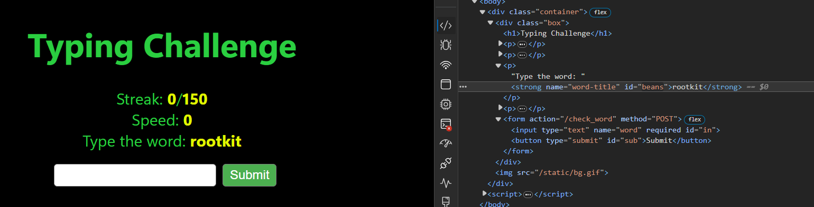

# Hacker Typer

This is a browser-based typing test where you have to enter infosec-related words fast enough 150 times in a row.



I added names to the elements for the word, the input box and the submit button, and used this code in the browser console to automate the game:
```js
setInterval(() => {
    content = document.querySelector("#beans").innerHTML
    document.querySelector("#in").value = content
    document.forms[0].requestSubmit(document.querySelector("#sub"))
}, 300)
```