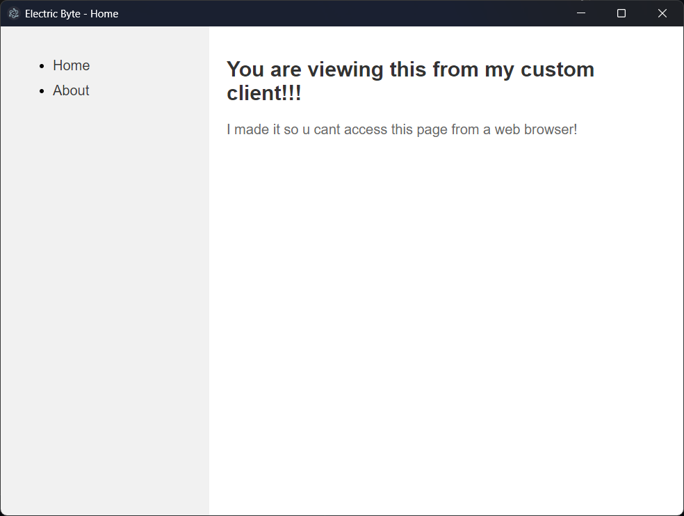
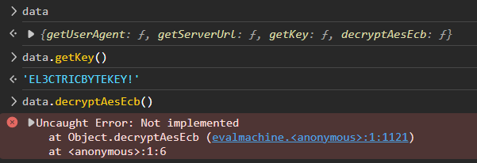

# Electric Byte

This consists of a webpage that's inaccessible from the browser, but accessible from the provided Electron app.



The app installs itself to `%LocalAppData%\electric_byte\app-1.0.0` . Here, we can find the [ASAR file](https://www.electronjs.org/docs/latest/tutorial/asar-archives) in `resources\app.asar`. Extracting it reveals the following:
```
$ npx @electron/asar extract app.asar .

├── app.asar
├── data.jsc
├── forge.config.js
├── main.js
├── node_modules
├── package-lock.json
├── package.json
└── pages
    └── index.html
```


In `main.js`, we can find out what's happening under the hood:
```js
// Electron app
const { app, BrowserWindow, session, protocol } = require( 'electron' );
const bytenode = require( 'bytenode' );

let data = require( './data.jsc' );

// Decryption is not needed since we don't access /secure/XXX pages here!

let mainWindow;

const SERVER_URL = data.getServerUrl( );
const USER_AGENT = data.getUserAgent( );
// Dont need anything else since secure page is disabled

function createWindow() {
    mainWindow = new BrowserWindow( {
        width: 800,
        height: 600,
        webPreferences: {
            nodeIntegration: true,
            devTools: false,
        }
    } );

    mainWindow.setMenu( null );
    mainWindow.loadURL( SERVER_URL );

    mainWindow.on( 'closed', function( ) {
        mainWindow = null;
    } );
}

app.whenReady( ).then( ( ) => {
    createWindow( )
    session.defaultSession.webRequest.onBeforeSendHeaders( ( details, callback ) => {
        details.requestHeaders[ 'User-Agent' ] = USER_AGENT;
        callback( { cancel: false, requestHeaders: details.requestHeaders } );
    } );
} )

app.on( 'window-all-closed', function() {
    if ( process.platform !== 'darwin' ) app.quit( );
} );
```

Keep in mind this comment for later:
```
// Decryption is not needed since we don't access /secure/XXX pages here!
```

It uses V8 bytecode compiled with [Bytenode](https://github.com/bytenode/bytenode) from `data.jsc` that exports a JS object. It behaves like an ordinary object from a text file, meaning we can inspect its properties even without direct access to its source.

We can `npm install` and install Electron ourselves to run the extracted source. V8 bytecode is highly specific to the specific version of V8 used, so we'll have to find the exact version of Electron used. Luckily, this can easily be found in the Electron binary itself.
```
$ strings .\electric-byte.exe | Select-String 'Electron/'

electron/js2c/asar_bundle
Chrome/118.0.5993.144 Electron/27.1.2
%s/%s Chrome/%s Electron/27.1.2
electron/js2c/
electron/js2c/sandbox_bundle
electron/js2c/isolated_bundle

$ npm install electron@27.1.2
```

We can now launch the app with any source code modifications we want, and with the `--inspect` flag enabled for debugging. First, we'll add this to allow us to see `data` in devtools, and open the frontend devtools on launch.

```diff
let data = require( './data.jsc' );
+ globalThis.data = data

mainWindow = new BrowserWindow( {
    width: 800,
    height: 600,
    webPreferences: {
        nodeIntegration: true,
-       devTools: false,
+       devTools: true,
    }
} );

mainWindow.loadURL( SERVER_URL );
+ mainWindow.webContents.openDevTools();
```
And  launch the app and attach to it in `chrome://inspect`:
```
npx electron main.js --inspect
```
In the Node devtools console, we can now see the contents of `data`, with two especially interesting members:
   
We can also see a hidden link to a page `/secret/admin` in the Electron window's devtools. Now the comment from earlier makes sense!

*screenshot pending because the server was taken down*

Loading this page gives us some garbled bytes, which we can infer is probably AES ECB encrypted using the given key. We can download the page content and decrypt it as usual:
```
from Crypto.Cipher import AES

with open('page.enc', 'rb') as file:
    data = file.read()
    e = AES.new(b"EL3CTRICBYTEKEY!", AES.MODE_ECB)
    print(e.decrypt(data))
```
This gives us an HTML document containing the flag in Base64.